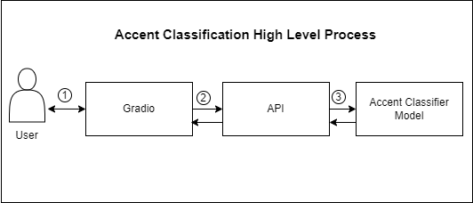

# Accent Classification
This project aims to classify English accents - American, British, or Australian based on a video URL.

# Introduction
This is a simple accent classification project. 
The use case can be shown as the following: 

# Getting Started
This project consist of three sub projects: 
- **model_accent_classification**: Builds a transformer-based model (Facebook Wav2Vec2) to classify accents (American, British, Australian)
- **api_accent_classification**: Exposes the model as an API using FastAPI
- **gradio**: A Gradio frontend for easy interaction.

I assume you already have Python installed on your local machine. Please follow the steps below to start the project:
- Since the project scope requires extracting audio from video, we need to download ffmpeg from https://www.gyan.dev/ffmpeg/builds/
- Setup the ffmpeg in your environment variable
- Open your terminal and navigate to the root project i.e. accent_classification folder
- Enter this command to install the dependencies: `pip install -r requirements.txt`
- Run the API by navigating to the `api_accent_classification` folder
- Enter this command: `python ./main.py`
- You can check whether the API is running by testing it via Postman or other API client tools `localhost:8000/accent/classify`

- Open another terminal then navigate to gradio folder
- Enter this command: `python ./main.py`
- Access the gradio via browser in `localhost:7860`

# Notes
There is still much room for improvement, especially regarding model performance. 
`Disclaimer`: Due to time constraints, hyperparameter optimization was not performed, and the dataset used may not be entirely accurate. I used the Common Voice Delta Segment 21.0 dataset from https://commonvoice.mozilla.org/en/datasets,
which does not contain explicit accent labels. I randomly sampled and grouped data into folders (american, british, and australian) for model training purpose.   
For better results, consider replacing the dataset under `model_accent_classification/data` and retraining the model with hyperparameter optimization.
The model cannot be pushed to GitHub because its size exceeds GitHub’s file size limit. Therefore, I’ve uploaded the model to Hugging Face: https://huggingface.co/luckyp71/accent-classifier-model/tree/main.
There is no need to modify the API code, as it loads the model from Hugging Face directly.